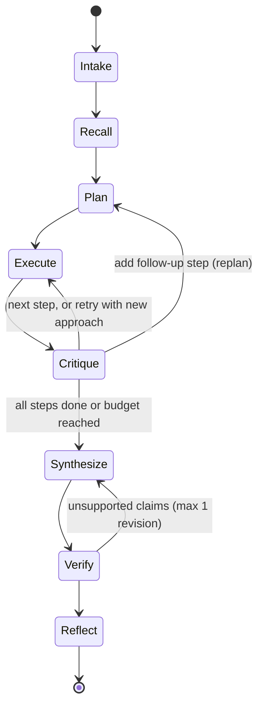
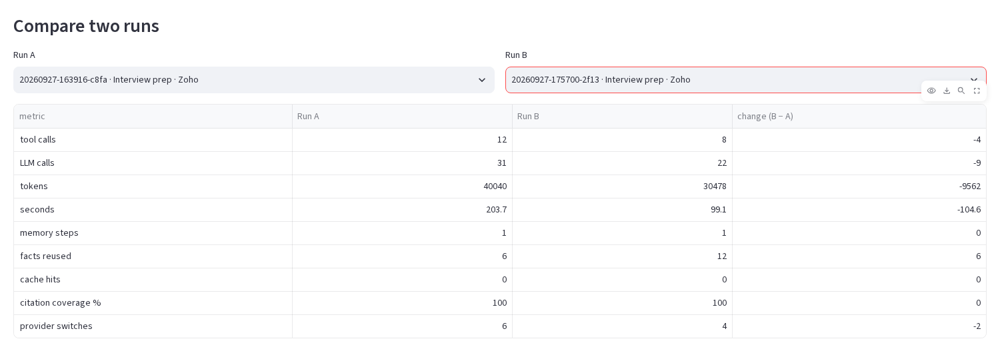

# Scout 🔭

**A purpose-aware company intelligence agent: give it a company and a reason, and it plans research around that reason, cites every claim, checks its own work, and gets faster with every run.**

   

**📊 Deck:** [Scout_deck.pdf](docs/Scout_deck.pdf) · [Scout_deck.pptx](docs/Scout_deck.pptx) &nbsp;·&nbsp; **🏗️ Architecture:** [docs/architecture.md](docs/architecture.md) &nbsp;·&nbsp; **🧪 Evals:** [evals/results.md](evals/results.md) &nbsp;·&nbsp; **📁 Real runs:** [examples/](examples/)


## At a glance

| | |
|---|---|
| **Problem** | A sales rep, a competitor analyst and an interview candidate need *different* facts about the same company, but research agents run one generic prompt. |
| **Approach** | Intake → Recall → Plan → [Execute ⇄ Critique]* → Synthesize → Verify → Reflect, as an explicit state machine with budgets on every loop. |
| **Agentic patterns** | Plan-and-Execute, ReAct with tools, critic routing (retry / replan / unknown), deterministic self-verification, Reflexion-style lessons, human feedback, provider failover. |
| **Trust** | Every claim cites collected evidence (100% coverage across 13 runs); numbers must appear in a cited snippet; 7 unverifiable claims went to *Unknowns* instead of the brief. |
| **Learning** | Same question asked twice: **−33% tool calls, −29% LLM calls, −24% tokens, −51% time**, with 2× the facts reused ([proof](#how-it-learns-with-use)). |
| **Try it** | No API key needed: clone, install, `python -m scout ui`, pick any `example · …` run to replay it. |

**Contents:** [Quickstart](#quickstart) · [Architecture](#architecture) · [Agentic patterns](#agentic-patterns-map) · [How it learns](#how-it-learns-with-use) · [Sample I/O](#sample-input-and-output) · [Evals](#evals) · [Reliability and safety](#reliability-and-safety) · [Design decisions](#design-decisions-and-trade-offs) · [Limitations](#limitations-and-future-work)

## Why Scout

Most research agents run one generic prompt, but *why* you are asking changes *what* you need: a sales rep, a competitor analyst and an interview candidate need different facts about the same company. Scout turns the purpose into a playbook-guided plan, researches it step by step with tools, and has a critic and a deterministic verifier check the work before a cited brief is written. Every run leaves memory behind (verified facts, source reliability scores, strategy lessons), so the next run on a related goal is cheaper and better planned.

## Quickstart

Needs Python 3.11 or newer (`python3 --version`). If your `python3` is older, use `python3.11`/`python3.12`, or `uv venv --seed -p 3.12 .venv` in the second command.

```bash
git clone https://github.com/UditSinghChauhan/scout-agent.git && cd scout-agent
python3 -m venv .venv && source .venv/bin/activate
pip install -r requirements.txt
cp .env.example .env        # optional: add keys for live runs (see the file)
python -m scout ui          # then open http://localhost:8501
```

**No API key is needed to replay the example runs**: pick any `example · …` run in the sidebar. Live runs need a Groq and/or Gemini key in `.env` (free tiers work). From the terminal: `python -m scout run "Prep me for an SDE intern interview at Zoho."`.

### Repository map

```text
scout/agent/      orchestrator (state machine), intake, planner, executor, critic, synthesizer, verifier, reflector
scout/tools/      web_search, fetch_page (SSRF guard), registry, cache
scout/memory/     SQLite store: runs, facts, sources, lessons, feedback
scout/prompts/    one Markdown prompt per stage
scout/ui/ app/    Streamlit UI: live runs, replay, insights
examples/         5 recorded real runs: trace.jsonl, report.md, metrics.json
evals/            task set and results from recorded runs
tests/            258 offline tests (fake LLM + fake search)
docs/             deck, architecture, spec, screenshots
```

## Architecture

An explicit, hand-written state machine (no agent framework). The orchestrator is a Python generator that yields events; the CLI, the Streamlit UI and the trace file all consume the same stream.



| Component | File | Role |
|---|---|---|
| Orchestrator | [`scout/agent/orchestrator.py`](scout/agent/orchestrator.py) | State machine, budgets, event stream |
| Intake / Planner | [`intake.py`](scout/agent/intake.py), [`planner.py`](scout/agent/planner.py) | Goal → task → purpose-shaped plan (playbooks in [`playbooks.py`](scout/playbooks.py)) |
| Executor | [`scout/agent/executor.py`](scout/agent/executor.py) | ReAct loop per step, evidence ledger |
| Critic | [`scout/agent/critic.py`](scout/agent/critic.py) | Verdict per step + per-source ratings |
| Synthesizer / Verifier | [`synthesizer.py`](scout/agent/synthesizer.py), [`verifier.py`](scout/agent/verifier.py) | Cited brief; citation + numeric-fidelity checks |
| Reflector | [`scout/agent/reflector.py`](scout/agent/reflector.py) | Strategy lessons and votes |
| Tools | [`scout/tools/`](scout/tools/) | `web_search` (Tavily → DuckDuckGo), `fetch_page` (SSRF-guarded), `recall_memory` |
| Memory | [`scout/memory/store.py`](scout/memory/store.py) | SQLite: runs, facts, sources, lessons, feedback |
| LLM + router | [`scout/llm.py`](scout/llm.py), [`scout/router.py`](scout/router.py) | JSON-validated calls, repair, backoff, provider failover |
| UI | [`app/streamlit_app.py`](app/streamlit_app.py), [`scout/ui/`](scout/ui/) | Live runs, replays, insights |

Prompts live in [`scout/prompts/`](scout/prompts/); all settings and budgets in [`scout/config.py`](scout/config.py). More detail: [docs/architecture.md](docs/architecture.md).

## Agentic patterns map

| Pattern | Where |
|---|---|
| Plan-and-Execute | [`planner.py`](scout/agent/planner.py) writes the plan, [`orchestrator.py`](scout/agent/orchestrator.py) runs it |
| ReAct (think → act → observe) | [`executor.py`](scout/agent/executor.py), JSON action protocol in [`prompts/executor.md`](scout/prompts/executor.md) |
| Tool use | [`tools/registry.py`](scout/tools/registry.py) (name, description, JSON argument schema per tool) |
| Critic routing (conditional edges) | [`critic.py`](scout/agent/critic.py) + `Orchestrator._execute`: complete / retry / follow-up / unknown |
| Self-verification | [`verifier.py`](scout/agent/verifier.py): deterministic checks, one LLM revision pass |
| Reflexion-style lessons | [`reflector.py`](scout/agent/reflector.py) + lesson ranking in [`memory/store.py`](scout/memory/store.py) |
| Human feedback | 👍/👎 per section → [`insights.py`](scout/insights.py) `apply_feedback` (source scores + lesson votes) |
| Provider router / failover | [`router.py`](scout/router.py), routing table in [`config.py`](scout/config.py) |

## How it learns with use

1. **Fact memory.** Verified evidence is stored per entity with its source URL, a timestamp and a volatility tag (stable facts live 7 days, news 2 days). The recall stage loads fresh, relevant facts; steps they answer are marked "from memory", skip research, and still cite the original URLs.
2. **Source reliability.** The critic rates every source it saw as useful or useless; each domain's score is `(useful + 1) / (useful + useless + 2)`, and search results are gently re-ranked by it. User 👍/👎 feed the same scores.
3. **Strategy lessons (Reflexion-style).** After each run the reflector writes 1–3 short, general lessons for that purpose and votes on the lessons it was given. The top 3 per purpose are injected into the next plan and shown in the UI.

All three proofs below come from four live runs recorded in the UI after a memory reset (committed in [`examples/`](examples/); numbers exactly as in each run's `metrics.json`).

**a. Same question asked twice: run 2 → run 4** (`Prep me for an SDE intern interview at Zoho.`, from `scripts/demo_summary.py`)

| run | memory steps | facts reused | tool calls | LLM calls | tokens | seconds | coverage % |
|---|---|---|---|---|---|---|---|
| [run 2 · 20260927-163916-c8fa](examples/20260927-163916-c8fa/) | 1 | 6 | 12 | 31 | 40,040 | 203.7 | 100.0 |
| [run 4 · 20260927-175700-2f13](examples/20260927-175700-2f13/) | 1 | 12 | 8 | 22 | 30,478 | 99.1 | 100.0 |

The second time, Scout reused twice as many verified facts and needed 33% fewer tool calls, 29% fewer LLM calls, 24% fewer tokens and half the time. It also planned with the 3 lessons run 2 wrote. Honest note: run 2 stopped at its 12-tool-call budget, so its cost is, if anything, understated.

**b. Same company, different purpose: run 1 (sales) vs run 2 (interview prep)**


Run 1 researched Zoho from a cold start for a sales pitch (size, campus programs, hiring tools, decision-maker roles, buying signals). Run 2 recalled 8 facts from run 1: memory answered Zoho's recruitment basics as step 1, and the interview plan spent its research on new questions (tech stack, recent news, engineering culture, interview formats). Because those questions were new, run 2 cost slightly more than run 1: 40,040 vs 38,866 tokens and 203.7 vs 172.8 s.

**c. New company, lessons applied: run 3** ([20260927-165252-222e](examples/20260927-165252-222e/), Freshworks, sales)

With no stored facts about Freshworks, the plan was shaped by the two lessons run 1 had written for sales prospects:

> - "Combine Google News with press‑release aggregators and the company’s investor‑relations page to capture funding rounds or strategic initiatives that signal buying intent."
> - "Use site-specific searches (e.g., "site:zoho.com careers" and "site:news.google.com Zoho" ) to locate campus hiring programs and recent corporate announcements quickly."

The Insights tab rebuilds all of this (runs, lessons, source scores, run and plan comparisons) **from the recorded runs alone, with no memory database**, so it works right after cloning. Run it yourself with `bash scripts/learning_demo.sh` (cold start, three runs, summary saved to `runs/`).

## Sample input and output

From [`examples/20260927-155410-bc87`](examples/20260927-155410-bc87/) (run 1: sales prospect, cold start):

**Goal:** "We sell a campus hiring-challenge platform. Research Zoho as a prospect and tell us how to pitch."

**Plan excerpt** (Sales prospect):
1. What is Zoho's overall company size, headquarters location, and global office footprint?
2. How many university recruitment programs, campus hiring events, or graduate‑entry roles does Zoho run annually, and which campuses are targeted?
3. What talent acquisition tools, assessment platforms, or hiring‑challenge solutions does Zoho currently use or mention in its tech stack?

**Trace excerpt** (run 2, step 2, from [`trace.jsonl`](examples/20260927-163916-c8fa/trace.jsonl)):
```text
tool_call  web_search(query="Zoho technology stack programming languages frameworks databases engineering blog")
tool_call  fetch_page(url="https://www.zdnet.com/article/zoho-full-stack-operating-system-and-data-protector")
critique   retry: "The executor failed to identify the primary backend language (Java) and specific CI/CD tools, relying on a low-quality aggregator..."
retry      new approach: search 'Zoho engineering blog Java' ... and fetch pages from zoho.com/insights or zoho.com/blog
tool_call  web_search(query="Zoho engineering blog Java backend technology stack Spring")
```

**Brief excerpt** ([`report.md`](examples/20260927-155410-bc87/report.md)):
> **Score:** Fit 70/100
>
> **Key takeaways**
> - Their existing recruitment stack (Zoho Recruit) integrates with HackerEarth assessments, showing openness to third‑party testing tools and a need for scalable campus‑hiring solutions. [1][2]
> - Key risk is that Zoho already has in‑house assessment features and no publicly identified senior owners of campus hiring, which may slow adoption and decision‑making. [3][4]

Full files: [report.md](examples/20260927-155410-bc87/report.md) · [trace.jsonl](examples/20260927-155410-bc87/trace.jsonl) · [metrics.json](examples/20260927-155410-bc87/metrics.json). Other examples: [run 2, interview prep partly from memory](examples/20260927-163916-c8fa/), [run 3, Freshworks with injected lessons](examples/20260927-165252-222e/), [run 4, the interview question asked again](examples/20260927-175700-2f13/), [a competitor run with a retry and honest Unknowns](examples/20260927-091106-7ac2/).


## Evals

`python -m scout eval --from-runs` scores every recorded run that went through the verifier ([full results](evals/results.md)). These are real development runs, not a curated benchmark:

| purpose | runs | median tokens | median seconds | mean coverage % | budget stops |
|---|---|---|---|---|---|
| competitor | 1 | 33,936 | 148.2 | 100.0 | 0 |
| interview_prep | 5 | 30,478 | 99.1 | 100.0 | 2 |
| sales_prospect | 7 | 40,444 | 155.3 | 100.0 | 1 |
| all | 13 | 38,190 | 137.0 | 100.0 | 3 |

Across these 13 runs the verifier flagged 24 claims (missing citations or numbers not found in the cited snippet); 7 could not be fixed in the revision pass and were moved to Unknowns instead of being published. `python -m scout eval --live evals/tasks.yaml` runs one fresh task per purpose.

Run 2 vs run 4 in the Insights tab (recorded runs, no database needed):



## Reliability and safety

- **Budgets** (all in `config.py`): 5 planned steps (8 with a follow-up), 3 ReAct iterations per step, 30 tool calls, 60 LLM calls, 480 s wall clock; a budget hit ends in a partial brief that says so. Backoff waits never overshoot the wall clock.
- **Critic routing:** complete, retry with a new approach (1 per step, 2 per run), one follow-up step per run, or unknown.
- **Verifier:** every claim must cite existing evidence, and every number in a claim must appear in a cited snippet; one revision pass, then leftovers move to Unknowns.
- **Untrusted content:** all web text is wrapped in `<untrusted_content>` (closing tags neutralised) and every prompt treats it as data, never instructions.
- **SSRF guard:** `fetch_page` allows only http/https, blocks localhost, private, link-local and other non-public addresses, re-checks every redirect, caps size and time.
- **Personal data:** roles only. Personal profile pages are never fetched or cited, lessons recommending them are discarded, and emails and phone numbers are scrubbed from the brief.
- **Provider router:** ordered candidates per tier with cooldowns on quota errors and long rate limits, failover on 401/403/404, every switch traced; rate-limit waits are shown live.
- **Tests:** 258 offline tests (`pytest -q`), no network: fakes for the LLM and search, including a Streamlit AppTest of the UI.

## Design decisions and trade-offs

- **No agent framework.** The state machine is one readable module (~650 lines); every transition, budget and failure path is explicit and testable, and the event stream makes replay and the UI trivial.
- **JSON action protocol instead of native tool calling.** It works on every OpenAI-compatible provider and is validated by Pydantic with one repair request. Some models insist on native function calls, so the `Action` schema also accepts that shape.
- **SQLite for memory.** Zero setup for anyone who clones the repo, transactional, and enough for per-user facts, scores and lessons.
- **Deterministic checks back the LLM.** Citations, numbers, personal-data rules, score formats and memory reuse are enforced in code; the LLM gets one chance to fix what the code flags.
- **Free-tier first.** Small prompts, a token diet (19k–58k tokens per full run across the recorded runs), caching and a multi-model router make it usable without paid keys, at the cost of speed when quotas bite.

## Limitations and future work

- Free-tier quotas (for example 200k tokens/day per Groq model) limit live runs to a handful per day; runs slow down when rate limits hit.
- Planner quality varies by model: weaker models ignore memory hints or plan vaguer steps (the deterministic memory pass compensates for the first).
- The numeric check is an exact match after normalisation ("1.05 billion" does not match "$1,050 million").
- DNS rebinding: addresses are validated before httpx resolves the host again; connections are not pinned to the checked IP.
- Search and page caches can be up to 24 h old.
- Lessons aren't always fully company-neutral yet (run 3 received a lesson mentioning site:zoho.com); a neutrality filter is future work.

Future work: scheduled recurring runs (competitor tracking), vector memory for fuzzy fact recall, parallel execution of independent steps, and exposing Scout as an MCP server.

## Disclosure

- **LLM providers (all free tier):** Groq — `openai/gpt-oss-120b`, `qwen/qwen3.8-27b`, `openai/gpt-oss-20b`; Google Gemini API — `gemini-flash-lite-latest` and `gemini-3.8-flash` (fallback). `gemma-4-31b-it` was probed and not used.
- **Search:** Tavily (free tier) with DuckDuckGo (`ddgs`) as fallback; page text extracted with `trafilatura`.
- **AI assistance:** AI assistants were used for architecture review, phase planning and implementation, directed and reviewed by the author.

## Links

- Deck (12 slides): [docs/Scout_deck.pdf](docs/Scout_deck.pdf) · [docs/Scout_deck.pptx](docs/Scout_deck.pptx)
- Specification: [docs/SPEC.md](docs/SPEC.md) · Architecture: [docs/architecture.md](docs/architecture.md)
- License: [MIT](LICENSE)
