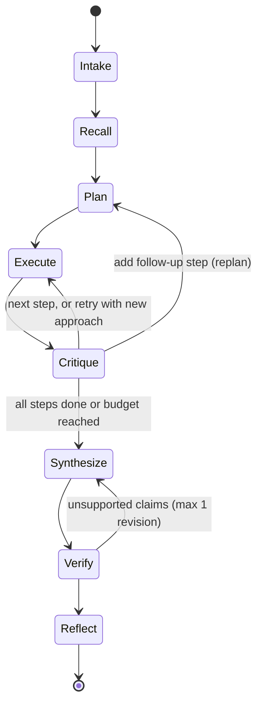

# Scout 🔭

**A purpose-aware company intelligence agent: give it a company and a reason, and it plans research around that reason, cites every claim, checks its own work, and gets faster with every run.**


## Why Scout

Most research agents run one generic prompt, but *why* you are asking changes *what* you need: a sales rep, a competitor analyst and an interview candidate need different facts about the same company. Scout turns the purpose into a playbook-guided plan, researches it step by step with tools, and has a critic and a deterministic verifier check the work before a cited brief is written. Every run leaves memory behind (verified facts, source reliability scores, strategy lessons), so the next run on a related goal is cheaper and better planned.

## Quickstart

Needs Python 3.11 or newer (`python3 --version`). If your `python3` is older, use `python3.11`/`python3.12`, or `uv venv --seed -p 3.12 .venv` in the second command.

```bash
git clone <repo-url> scout-agent && cd scout-agent
python3 -m venv .venv && source .venv/bin/activate
pip install -r requirements.txt
cp .env.example .env        # optional: add keys for live runs (see the file)
python -m scout ui          # then open http://localhost:8501
```

**No API key is needed to replay the example runs**: pick any `example · …` run in the sidebar. Live runs need a Groq and/or Gemini key in `.env` (free tiers work). From the terminal: `python -m scout run "Prep me for an SDE intern interview at Zoho."`.

## Architecture

An explicit, hand-written state machine (no agent framework). The orchestrator is a Python generator that yields events; the CLI, the Streamlit UI and the trace file all consume the same stream.



| Component | File | Role |
|---|---|---|
| Orchestrator | [`scout/agent/orchestrator.py`](scout/agent/orchestrator.py) | State machine, budgets, event stream |
| Intake / Planner | [`intake.py`](scout/agent/intake.py), [`planner.py`](scout/agent/planner.py) | Goal → task → purpose-shaped plan (playbooks in [`playbooks.py`](scout/playbooks.py)) |
| Executor | [`scout/agent/executor.py`](scout/agent/executor.py) | ReAct loop per step, evidence ledger |
| Critic | [`scout/agent/critic.py`](scout/agent/critic.py) | Verdict per step + per-source ratings |
| Synthesizer / Verifier | [`synthesizer.py`](scout/agent/synthesizer.py), [`verifier.py`](scout/agent/verifier.py) | Cited brief; citation + numeric-fidelity checks |
| Reflector | [`scout/agent/reflector.py`](scout/agent/reflector.py) | Strategy lessons and votes |
| Tools | [`scout/tools/`](scout/tools/) | `web_search` (Tavily → DuckDuckGo), `fetch_page` (SSRF-guarded), `recall_memory` |
| Memory | [`scout/memory/store.py`](scout/memory/store.py) | SQLite: runs, facts, sources, lessons, feedback |
| LLM + router | [`scout/llm.py`](scout/llm.py), [`scout/router.py`](scout/router.py) | JSON-validated calls, repair, backoff, provider failover |
| UI | [`app/streamlit_app.py`](app/streamlit_app.py), [`scout/ui/`](scout/ui/) | Live runs, replays, insights |

Prompts live in [`scout/prompts/`](scout/prompts/); all settings and budgets in [`scout/config.py`](scout/config.py). More detail: [docs/architecture.md](docs/architecture.md).

## Agentic patterns map

| Pattern | Where |
|---|---|
| Plan-and-Execute | [`planner.py`](scout/agent/planner.py) writes the plan, [`orchestrator.py`](scout/agent/orchestrator.py) runs it |
| ReAct (think → act → observe) | [`executor.py`](scout/agent/executor.py), JSON action protocol in [`prompts/executor.md`](scout/prompts/executor.md) |
| Tool use | [`tools/registry.py`](scout/tools/registry.py) (name, description, JSON argument schema per tool) |
| Critic routing (conditional edges) | [`critic.py`](scout/agent/critic.py) + `Orchestrator._execute`: complete / retry / follow-up / unknown |
| Self-verification | [`verifier.py`](scout/agent/verifier.py): deterministic checks, one LLM revision pass |
| Reflexion-style lessons | [`reflector.py`](scout/agent/reflector.py) + lesson ranking in [`memory/store.py`](scout/memory/store.py) |
| Human feedback | 👍/👎 per section → [`insights.py`](scout/insights.py) `apply_feedback` (source scores + lesson votes) |
| Provider router / failover | [`router.py`](scout/router.py), routing table in [`config.py`](scout/config.py) |

## How it learns with use

1. **Fact memory.** Verified evidence is stored per entity with its source URL, a timestamp and a volatility tag (stable facts live 7 days, news 2 days). The recall stage loads fresh, relevant facts; steps they answer are marked "from memory", skip research, and still cite the original URLs.
2. **Source reliability.** The critic rates every source it saw as useful or useless; each domain's score is `(useful + 1) / (useful + useless + 2)`, and search results are gently re-ranked by it. User 👍/👎 feed the same scores.
3. **Strategy lessons (Reflexion-style).** After each run the reflector writes 1–3 short, general lessons for that purpose and votes on the lessons it was given. The top 3 per purpose are injected into the next plan and shown in the UI.

Same goal, before and after memory (`Prep me for an SDE intern interview at Zoho.`), from `scripts/demo_summary.py`:

| run | memory steps | facts reused | tool calls | LLM calls | tokens | seconds | coverage % |
|---|---|---|---|---|---|---|---|
| 20260927-095935-6ee7 (no memory used) | 0 | 0 | 11 | 27 | 38,190 | 122.0 | 100.0 |
| 20260927-100630-4c66 (answered partly from memory) | 1 | 6 | 5 | 16 | 18,861 | 32.2 | 100.0 |

Honest caveat: the second run was made on memory restored to its exact post-run-1 state (the first attempt at this comparison showed that the planner model did not flag memory steps; a deterministic memory pass was added and the run repeated). Part of the saving also comes from the planner choosing fewer research steps once memory covered the company overview. A clean, uninterrupted learning-demo table will replace this one:

<!-- DEMO_TABLE -->

Run it yourself with `bash scripts/learning_demo.sh` (cold start, three runs, summary saved to `runs/`).

## Sample input and output

From [`examples/20260927-095658-c06c`](examples/20260927-095658-c06c/) (sales prospect, cold start):

**Goal:** "We sell a campus hiring-challenge platform. Research Zoho as a prospect and tell us how to pitch."

**Plan excerpt** (purpose `sales_prospect`):
1. What is Zoho's overall company size, headquarters location, and global office footprint?
2. How many university recruitment programs, campus hiring events, or graduate-entry roles does Zoho run annually?
3. What recruiting tools, assessment platforms, or talent-acquisition technologies does Zoho currently use?

**Trace excerpt** (step 3, from `trace.jsonl`):
```text
critique  retry: "No information was gathered; the executor made no tool calls and provided no sources."
retry     new approach: search recent Zoho blog posts, careers pages or news for recruiting/assessment platforms
provider_switched  fast: groq/openai/gpt-oss-120b -> groq/openai/gpt-oss-20b (quota exhausted: tokens per day)
tool_call web_search(query="Zoho hiring process assessment platform")
tool_result 5 results
```

**Brief excerpt** (`report.md`):
> **Score:** Fit 75/100
> - Zoho Corporation is a global software company headquartered in Chennai, India, with over 18,000 employees as of 2025. [1]
> - Active job postings increased to 162 in 2026, up from 119 in 2025, indicating sustained hiring activity. [2]

Full files: [report.md](examples/20260927-095658-c06c/report.md) · [trace.jsonl](examples/20260927-095658-c06c/trace.jsonl) · [metrics.json](examples/20260927-095658-c06c/metrics.json). Other examples: [interview prep answered from memory](examples/20260927-100630-4c66/), [competitor with a retry and honest Unknowns](examples/20260927-091106-7ac2/), [sales run with injected lessons](examples/20260927-100359-ee0a/).


## Evals

`python -m scout eval --from-runs` scores every recorded run that went through the verifier ([full results](evals/results.md)). These are real development runs, not a curated benchmark:

| purpose | runs | median tokens | median seconds | mean coverage % | budget stops |
|---|---|---|---|---|---|
| competitor | 1 | 33,936 | 148.2 | 100.0 | 0 |
| interview_prep | 3 | 29,723 | 56.4 | 100.0 | 1 |
| sales_prospect | 5 | 44,729 | 155.3 | 100.0 | 0 |
| all | 9 | 33,936 | 137.0 | 100.0 | 1 |

Across these runs the verifier flagged 13 claims (missing citations or numbers not found in the cited snippet); 5 could not be fixed in the revision pass and were moved to Unknowns instead of being published. `python -m scout eval --live evals/tasks.yaml` runs one fresh task per purpose.


## Reliability and safety

- **Budgets** (all in `config.py`): 5 planned steps (8 with a follow-up), 3 ReAct iterations per step, 30 tool calls, 60 LLM calls, 480 s wall clock; a budget hit ends in a partial brief that says so. Backoff waits never overshoot the wall clock.
- **Critic routing:** complete, retry with a new approach (1 per step, 2 per run), one follow-up step per run, or unknown.
- **Verifier:** every claim must cite existing evidence, and every number in a claim must appear in a cited snippet; one revision pass, then leftovers move to Unknowns.
- **Untrusted content:** all web text is wrapped in `<untrusted_content>` (closing tags neutralised) and every prompt treats it as data, never instructions.
- **SSRF guard:** `fetch_page` allows only http/https, blocks localhost, private, link-local and other non-public addresses, re-checks every redirect, caps size and time.
- **Personal data:** roles only. Personal profile pages are never fetched or cited, lessons recommending them are discarded, and emails and phone numbers are scrubbed from the brief.
- **Provider router:** ordered candidates per tier with cooldowns on quota errors and long rate limits, failover on 401/403/404, every switch traced; rate-limit waits are shown live.
- **Tests:** 258 offline tests (`pytest -q`), no network: fakes for the LLM and search, including a Streamlit AppTest of the UI.

## Design decisions and trade-offs

- **No agent framework.** The state machine is one readable module (~650 lines); every transition, budget and failure path is explicit and testable, and the event stream makes replay and the UI trivial.
- **JSON action protocol instead of native tool calling.** It works on every OpenAI-compatible provider and is validated by Pydantic with one repair request. Some models insist on native function calls, so the `Action` schema also accepts that shape.
- **SQLite for memory.** Zero setup for anyone who clones the repo, transactional, and enough for per-user facts, scores and lessons.
- **Deterministic checks back the LLM.** Citations, numbers, personal-data rules, score formats and memory reuse are enforced in code; the LLM gets one chance to fix what the code flags.
- **Free-tier first.** Small prompts, a token diet (19k–58k tokens per full run in the recorded development runs), caching and a multi-model router make it usable without paid keys, at the cost of speed when quotas bite.

## Limitations and future work

- Free-tier quotas (for example 200k tokens/day per Groq model) limit live runs to a handful per day; runs slow down when rate limits hit.
- Planner quality varies by model: weaker models ignore memory hints or plan vaguer steps (the deterministic memory pass compensates for the first).
- The numeric check is an exact match after normalisation ("1.05 billion" does not match "$1,050 million").
- DNS rebinding: addresses are validated before httpx resolves the host again; connections are not pinned to the checked IP.
- Search and page caches can be up to 24 h old.

Future work: scheduled recurring runs (competitor tracking), vector memory for fuzzy fact recall, parallel execution of independent steps, and exposing Scout as an MCP server.

## Disclosure

- **LLM providers (all free tier):** Groq — `openai/gpt-oss-120b`, `qwen/qwen3.8-27b`, `openai/gpt-oss-20b`; Google Gemini API — `gemini-flash-lite-latest` and `gemini-3.8-flash` (fallback). `gemma-4-31b-it` was probed and not used.
- **Search:** Tavily (free tier) with DuckDuckGo (`ddgs`) as fallback; page text extracted with `trafilatura`.
- **AI assistance:** Claude was used for architecture review and phase planning; Claude Code was used for implementation, directed and reviewed by the author.

## Links

- Demo video: _coming soon_
- Slides: [docs/Scout_slides.pdf](docs/Scout_slides.pdf) (source: [docs/slides.md](docs/slides.md))
- Specification: [docs/SPEC.md](docs/SPEC.md) · Architecture: [docs/architecture.md](docs/architecture.md)
- License: [MIT](LICENSE)
