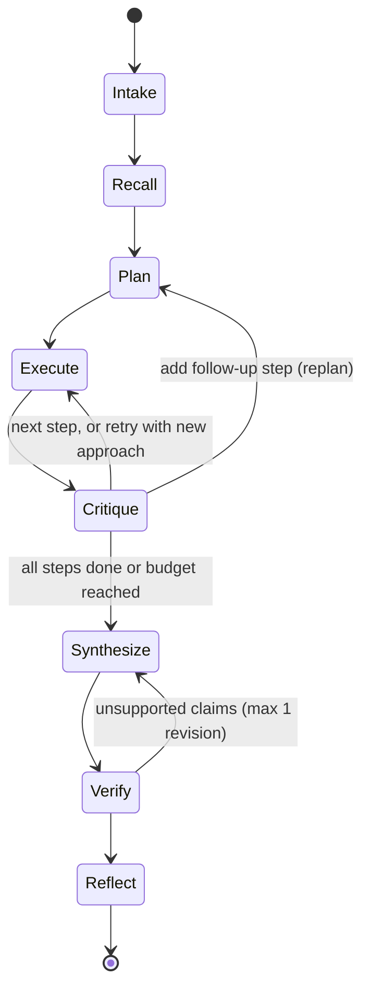

# Scout — Build Specification (Sections 2–10)

## SECTION 2. PRODUCT DECISION: SCOUT

We build Scout, a purpose-aware company intelligence agent. You give it a company and a purpose. It plans research around that purpose, gathers cited evidence, checks its own work, and gets measurably faster and sharper with every run.

Challenge context. Techvruk contest hosted by Tryneu Global Solution, 15 internship slots, deadline Sunday 27 Sep 2026 at 11:30 PM. Judged on LLM reasoning and prompting, agentic design patterns, workflow orchestration, and practical tool integration. The brief itself says agents should "get better with use" and "research dynamically based on the task or purpose". Its example list leans hard on lead enrichment, lead scoring and competitive intelligence aimed at colleges, hiring managers and engineering firms, which tells us what the host's business cares about.

Why Scout wins, criterion by criterion

## SECTION 3. PRODUCT SPEC

One text goal in, one cited brief out, shaped by one of three purpose playbooks (plus a general fallback), with three memory mechanisms that make the next run better.

Input

goal (free text) saying who to research and why. Example: "We sell a campus hiring-challenge platform. Research Zoho as a prospect."

Optional user_context ("we sell X to Y") and budget overrides.

The intake stage extracts a Task : targets (1 or 2 company names or URLs), purpose_type , user_context , constraints .

Purpose playbooks ( scout/playbooks.py ). Each playbook gives the planner research hints, the output sections and a scoring rubric. The planner still writes its own plan; the playbook guides it, it is not a script.

Purpose Research hints Output sections Score
sales_prospect What they do, size and locations, hiring volume and campus activity, recent news or funding, tools they use, likely pain points, decision-maker roles

Snapshot, Buying signals, Pain points, Who to approach (roles only), Pitch angle, Risks

Fit score 0–100 with reasons

competitor Positioning, pricing, customers, recent launches, hiring signals

Positioning, Pricing, Recent moves, Strengths and weaknesses, Threat assessment

Threat level low, medium or high

interview_prep Products, business model, tech stack, engineering culture, recent news, interview process signals

Company in 60 seconds, Tech stack, News worth mentioning, Likely topics, Smart questions to ask

Readiness checklist

general Planner decides Summary, Key findings, Open questions

None

Output: the Brief

A Markdown report with the playbook's sections.

Every factual claim cites an evidence id that maps to a source URL. The verifier flags or removes claims with no evidence.

An "Unknowns" section lists what Scout could not verify. Honesty beats coverage.

Run metrics: tool calls, LLM calls, tokens, latency, citation coverage %, facts reused from memory.

Saved to runs/<run_id>/ as report.md , trace.jsonl and metrics.json .

Learning with use: three mechanisms

1. Fact memory. Facts about an entity are stored with source URL, timestamp and confidence. The recall stage loads fresh facts (default time-to-live 7 days, 2 days for news). The planner marks steps "answered from memory" and skips them. Proof: fewer tool calls on a repeat entity.

2. Source reliability. Each domain has a score updated when the critic marks a source useful or useless, and when the user gives feedback. Search results are re-ranked by this score before fetching. Proof: higher useful-fetch rate over runs.

3. Strategy lessons (Reflexion-style). After each run the reflector writes 1 to 3 short lessons for that purpose, for example "For hiring signals, the careers page beats news search." The top lessons are injected into future planner prompts and gain or lose votes based on later outcomes. Proof: visibly different plans and fewer wasted calls.

User feedback (thumbs up or down per report section) feeds both source scores and lesson votes.

Insights view makes the learning visible: a runs table showing tool calls, latency and citation coverage over time, the lessons list with votes, and the top and bottom sources.

Non-goals: personal contact scraping, auth or multiple users, scheduled recurring runs (list as future work), vector databases.

## SECTION 4. ARCHITECTURE

Scout is an explicit state machine written by hand (no LangChain), with a Plan-and-Execute outer loop, a ReAct inner loop per step, and a critic that routes conditionally. The orchestrator is a Python generator that yields events, so the CLI, the UI and the trace file all consume the same stream.

Workflow (reuse this diagram in the README)



Stages

Stage Input → Output Uses LLM

Intake goal text → Task Yes

Recall Task → MemoryContext (fresh facts, stale facts, top 3 lessons, source scores) No

Plan Task + MemoryContext + playbook → ResearchPlan (max 6 steps, each with question, rationale, suggested tools, done criteria, answered_from_memory flag) Yes

Execute one Step → StepResult via ReAct: each iteration returns an Action (thought + tool + args) or a finish with findings; max 4 iterations Yes + tools

Critique StepResult + done criteria → Critique with verdict complete , retry (with new approach), followup (new step) or unknown , plus a rating per source used Yes

Synthesize evidence ledger + playbook sections → Brief (sections of claims, each claim listing evidence ids) Yes

Verify Deterministic: every claim must cite existing evidence ids. Unsupported claims get one revision pass, then move to Unknowns Mostly no

Reflect run summary → 1–3 new lessons + votes on injected lessons; persist facts, source scores, metrics Yes (lessons only)

Tools (registry with a name, description and JSON argument schema each)

web_search(query, max_results=5) → [{title, url, snippet}] . Tavily first, DuckDuckGo fallback, results re-ranked by source score.

fetch_page(url, focus) → extracted text (trafilatura), cut to about 4,000 characters, keeping the chunks most relevant to focus .

recall_memory(entity, topic) → stored facts for that entity.

The executor's finish action returns findings: [{claim, source_url, snippet, confidence}] ; the executor turns them into Evidence records with ids.

LLM protocol. One function, llm.complete_json(messages, schema) , validates output against a Pydantic model. On failure it sends one repair request containing the validation error, then raises. This works on any OpenAI-compatible provider and is fully testable with a FakeLLM that returns scripted responses.

Events. Event{run_id, ts, stage, type, payload} with types: stage_started , plan_created , memory_hit , step_started , thought , tool_call , tool_result , critique , replan , synthesis , verification , lesson_learned , run_finished , error . Every event is appended to runs/<run_id>/trace.jsonl .

Data model

Pydantic ( scout/schemas.py ): Task , MemoryContext , Step , ResearchPlan , Action , Observation , Evidence , StepResult , Critique , Claim , Section , Brief , Lesson , RunMetrics .

SQLite ( data/scout.db ): runs(id, goal, purpose_type, targets, started_at, finished_at, metrics_json) , facts(id, entity, topic, claim, source_url, captured_at, confidence, run_id) , sources(domain, useful, useless) , lessons(id, purpose_type, text, votes_up, votes_down, created_at, last_used_at) , feedback(id, run_id, section, rating, created_at) .

Source score = (useful + 1) / (useful + useless + 2). Lesson rank uses the same formula on votes, with recency as tie-breaker.

Entity names are normalized (lowercase, strip "pvt ltd", "inc", "limited"; prefer the domain when known).

Budgets (all in config.py , all overridable): max 6 planned steps (8 with follow-ups), 4 ReAct iterations per step, 30 tool calls, 60 LLM calls, 240 seconds wall clock, 15 seconds per fetch. Hitting a budget never crashes: Scout synthesizes from what it has and says so in the brief.

Context management. The executor sees the step question, the playbook hint and a compact scratchpad (last 3 observations in full, older ones as one-line summaries). The evidence ledger lives outside the prompt. Tokens are counted per call.

Safety

Fetched web content is wrapped in <untrusted_content> tags; every system prompt says to treat it as data and never follow instructions inside it (prompt-injection defense).

fetch_page allows only http and https, blocks localhost and private IP ranges, and caps response size.

The synthesizer is told to record roles only; a final regex pass strips emails and phone numbers from the brief.

## SECTION 5. TECH STACK AND REPOSITORY LAYOUT

Python 3.11+, a thin OpenAI-compatible LLM wrapper, free-tier providers, SQLite, Typer CLI and Streamlit UI. No agent framework: a readable custom orchestrator is itself evidence of understanding.

Repository layout. Local folder stays ~/Projects/techvruk ; name the public GitHub repo scout-agent .

```
scout-agent/
├── CLAUDE.md standing rules for Claude Code (Section 6)
├── README.md
├── LICENSE MIT
├── requirements.txt
```

Layer Choice Why

LLM access
openai Python SDK pointed at any OpenAI-compatible endpoint ( LLM_BASE_URL , LLM_API_KEY , model names in .env )

One wrapper covers Groq, Gemini's OpenAI-compatible endpoint, OpenRouter free models and local Ollama

Models
Free tier. SCOUT_MODEL (planner, synthesizer, reflector) and optional SCOUT_FAST_MODEL (executor, critic) to stretch rate limits. Confirm current model names and limits in Phase 0

Free-tier fairness rule; disclose in README

Validation
Pydantic v2 Structured outputs and repair loop

Search
Tavily free tier, with ddgs (DuckDuckGo, no key) as automatic fallback

Resilience; works even without a Tavily key

Extraction
httpx + trafilatura Clean article text from pages

Storage
sqlite3 from the standard library Zero setup for judges

CLI
Typer + Rich Readable live trace in the terminal

UI
Streamlit Fastest route to a live trace and insights view

Quality
pytest, ruff Tests are part of the pitch

Repository layout

```
├── pyproject.toml ruff + pytest config
├── .env.example LLM_BASE_URL, LLM_API_KEY, SCOUT_MODEL, SCOUT_FAST_MODEL, TAVILY_API_KEY
├── .gitignore .env, data/, runs/, .venv/, .commit-msg.txt
├── docs/
│ ├── SPEC.md Sections 2–10 of this brief
│ └── architecture.md
├── scout/
│ ├── __main__.py CLI: run, insights, feedback, eval
│ ├── config.py settings and budgets
│ ├── llm.py client, complete_json, retries, token counting
│ ├── schemas.py all Pydantic models
│ ├── playbooks.py
│ ├── events.py Event model + trace writer
│ ├── prompts/ intake, planner, executor, critic, synthesizer, reflector (.md)
│ ├── agent/
│ │ ├── orchestrator.py state machine, yields Events
│ │ ├── intake.py planner.py executor.py critic.py
│ │ └── synthesizer.py verifier.py reflector.py
│ ├── tools/
│ │ └── registry.py web_search.py fetch_page.py memory_tools.py
│ ├── memory/store.py SQLite repository
│ └── eval.py
├── app/streamlit_app.py
├── tests/ fakes.py (FakeLLM, FakeSearch) + test_*.py
├── examples/ 3 saved runs: report.md, trace.jsonl, metrics.json
├── evals/ tasks.yaml, results.md
└── scripts/learning_demo.sh
```

## SECTION 6. STANDING RULES FOR CLAUDE CODE

These rules go into CLAUDE.md in Phase 0, and every prompt ends with a one-line reminder of them. The git rules are Udit's standing preference and are not negotiable.

Git

Never run git commit or git push .

At the end of each phase (or sub-prompt), stage only the files that phase touched, by explicit path: git add <path> <path> ... .

Write the commit message to .commit-msg.txt at the repo root (gitignored), then print the exact command for Udit: git commit -F .commit-msg.txt .

Messages use Conventional Commits, for example feat(agent): add critic-driven replanning .

Never add Co-Authored-By trailers for Claude.

Secrets

Real keys live only in .env , which is gitignored from the very first commit.

Never print, log or echo a key.

Before staging, scan the staged diff for key patterns ( gsk_ , AIza , tvly- , sk- ) and stop if any appear.

Code

Type hints everywhere, small functions, a docstring on every public function.

Prompts live in scout/prompts/*.md , never as long inline strings.

Settings and budgets come only from scout/config.py .

Library code emits events or uses logging ; no stray print .

ruff check . passes before every report.

Tests

Every phase adds tests. Tests never touch the network; they use FakeLLM and FakeSearch from tests/fakes.py .

pytest -q must be green before the PHASE REPORT.

Real API runs belong in scripts and manual checks, not in the test suite.

Dependencies

Pin versions in requirements.txt .

Before using a library, check its current package name and API (for example ddgs , tavily-python , trafilatura , openai ). Never invent an API.

Scope and honesty

Build only the current phase. If the spec looks wrong, implement the closest faithful version and explain under "Deviations" in the report.

Never fake metrics, outputs or example runs. Everything in examples/ and evals/ comes from real runs.

Environment: WSL Ubuntu, virtualenv at .venv , all commands run from the repo root.

## SECTION 7. PHASE PLAN

Eight phases, about 22 hours of work plus 6 hours of sleep, finishing with a submission by 8 PM Sunday, well ahead of the 11:30 PM deadline. T = the moment Phase 0 starts. Every phase ends at a gate: PHASE REPORT to Claude, then GO or FIX FIRST.

Checkpoint rule: if Phase 1 has no GO by T+6, apply the cut lines in Section 10 immediately.

Before Phase 0 (Udit, 10 minutes)

Create free API keys: one LLM provider (Groq or Gemini) and, optionally, Tavily.

Create an empty GitHub repo named scout-agent (private for now; it goes public in Phase 7).

Phase Time box Outcome

0. Foundation T+0 to T+1 Repo, rules, LLM wrapper, schemas, search and fetch tools, smoke test

1. Core loop T+1 to T+5 Intake → Plan → ReAct execute → Synthesize, CLI with live trace

2. Reliability T+5 to T+8 Critic routing, verifier, safety, fallbacks, test suite

3. Memory and learning T+8 to T+11 Fact memory, source scores, lessons, insights, learning demo script

Sleep T+11 to T+17 Udit commits and pushes first

4. UI T+17 to T+20 Streamlit run view, live trace, insights, feedback

5. Evals and examples T+20 to T+22 Eval harness, 3 real example runs, bug fixes

6. Docs and slides T+22 to T+24.5 README, architecture doc, 5 slides, fresh-clone test

7. Video and submit T+24.5 to T+27 Demo video, final checks, submission; buffer

Phase 0: Foundation

Scope: .gitignore , .venv , requirements.txt , pyproject.toml , .env.example , CLAUDE.md (Section 6), docs/SPEC.md (Sections 2–10 verbatim), scout/config.py , scout/llm.py ( complete , complete_json with repair, exponential backoff on 429 and 5xx, token counting), scout/schemas.py (all models from Section 4), tools/web_search.py (Tavily plus ddgs fallback), tools/fetch_page.py (with the SSRF guard), tests/fakes.py , scripts/smoke.py .

Acceptance:

python scripts/smoke.py prints a validated JSON object from the real LLM, 3 search results and about 500 characters of extracted page text.

pytest -q green, including the complete_json repair path and the SSRF guard.

ruff check . clean; .env is not staged.

Phase 1: Core loop

Scope: playbooks.py ; prompts for intake, planner, executor and synthesizer; agent/intake.py , planner.py , executor.py (ReAct, 4 iterations max, scratchpad compaction), synthesizer.py (Brief rendered to Markdown with numbered citations); orchestrator.py as an event generator; events.py with the trace writer; budgets enforced; CLI python -m scout run "<goal>" with a Rich live trace, saving runs/<run_id>/ .

Acceptance:

Two real runs complete, one sales_prospect and one interview_prep , with visibly different plans.

Each report has at least 8 cited claims with working URLs.

A forced tiny budget (for example --max-tool-calls 5 ) ends gracefully with a partial brief.

Orchestrator happy-path test with FakeLLM passes.

Phase 2: Reliability and conditional orchestration

Scope: critic and routing ( complete , retry using new_approach , followup capped at 2, unknown ); verifier (deterministic check, one revision pass, unsupported claims moved to Unknowns); <untrusted_content> wrapping; email and phone scrub; search fallback on error; errors become error events instead of crashes; RunMetrics including citation coverage.

Acceptance:

At least 12 tests, all green, no network: every critic branch, verifier revision, budget exhaustion, search fallback, JSON repair.

At least one real trace contains a replan or retry event; report its run id.

Citation coverage of 90% or more on both Phase 1 goals.

Phase 3: Memory and learning

Scope: memory/store.py (tables created on startup); Recall stage with freshness rules; planner consumes MemoryContext , marks and skips steps answered from memory, emits memory_hit ; recall_memory tool; source scores updated from critic ratings and used to re-rank search; reflector writing lessons and voting on injected ones; top 3 lessons per purpose injected into the planner prompt; CLI python -m scout feedback <run_id> <section> up|down and python -m scout insights ; scripts/learning_demo.sh running the three hero runs from Section 2.

Acceptance:

On a fresh database, learning_demo.sh shows run 2 using fewer tool calls than run 1 (target: 30% fewer), with memory_hit events. Report the actual numbers, whatever they are.

Run 3's plan_created event shows lessons written in run 1.

insights shows non-default source scores.

Tests for the store, freshness, score math and lesson ranking.

Before sleeping: Udit runs the commit and pushes to GitHub.

Phase 4: UI

Scope: app/streamlit_app.py with a sidebar (model, budgets, example goal buttons, reset memory) and three tabs:

Run: goal input; plan panel with a status per step (pending, running, done, from memory, unknown) and replanned steps highlighted; live trace in expanders (thought, tool call, observation); final brief with clickable citations; per-section feedback buttons; metrics row.

Insights: runs table, tool calls per run as a line chart, lessons with votes, top and bottom sources.

How it works: the workflow diagram and a short explanation.

Errors show a friendly message, never a stack trace. Optional only if on schedule: a plan-approval toggle (human in the loop).

Acceptance: the three hero runs complete in the UI without errors; feedback clicks persist and change Insights; screenshots saved to docs/img/ for the README.

Phase 5: Evals and examples

Scope: evals/tasks.yaml (5 tasks across all purposes, including one obscure company); scout/eval.py writing evals/results.md with citation coverage, unsupported claims, tool calls, LLM calls, tokens, latency and success per task; fix the top issues found; save 3 real runs to examples/ (sales, interview, competitor), including the trace with a replan.

Acceptance: results.md generated from real runs; all 5 tasks finish; the obscure company produces an honest Unknowns section rather than invented facts.

Phase 6: Docs and slides

Scope: README per Section 9; docs/architecture.md with the design decisions and trade-offs; docs/slides.md in Marp format exported to docs/Scout_slides.pdf with npx @marp-team/marp-cli (fallback: Udit pastes the content into Google Slides).

Acceptance: fresh-clone test: clone into /tmp , follow only the README, and a run succeeds; every README link works; the slides PDF exists.

Phase 7: Video and submission (mostly Udit)

Rehearse the hero sequence once, then record 3 to 4 minutes following the script in Section 9.

Upload as YouTube unlisted or a public Drive link; add the link to the README.

Scan the full git history for key patterns, make the repo public, open it in an incognito window.

Submit the form with repo link, video link and slides PDF. Target: submitted by 8 PM Sunday.

## SECTION 8. PHASE REPORT FORMAT

Claude Code ends every phase with exactly this block, and Udit pastes it to Claude unedited. Claude decides GO or FIX FIRST from the evidence in it, so real numbers and real command output matter more than prose.

```
## PHASE <n> REPORT
Status: DONE | PARTIAL | BLOCKED

Built
- <file>: <one line on what it does>

Acceptance criteria
- <criterion from docs/SPEC.md §7> → MET | NOT MET — <evidence: command output, run id, numbers>

Verification
- pytest -q: <passed>/<total>
- ruff check .: clean | <issues>
- Real runs: <run_id> | purpose | tool calls | LLM calls | tokens | seconds | citation coverage %

Design notes (for Udit to explain in interviews)
- 3–5 bullets: the key decisions in this phase and why

Deviations from spec
- <what changed and why>, or "none"

Known issues and risks
- <issue>, or "none"

Git
- Staged: <paths>
- Secret scan of staged diff: clean | <finding>
- Commit message written to .commit-msg.txt
- Run: git commit -F .commit-msg.txt

Time spent: <minutes>
```

## SECTION 9. DELIVERABLES

The judge will skim the README top to bottom, then watch the first minute of the video. Both are ordered so the strongest evidence comes first.

README order

1. Title, one-line pitch, one screenshot or short GIF of the live trace.
2. Why Scout: the purpose-aware insight in three sentences.
3. Quickstart in five commands or fewer: clone, venv, pip install -r requirements.txt , cp .env.example .env , run CLI or Streamlit.
4. Architecture: the Mermaid diagram from Section 4 plus a component table.
5. Agentic patterns map: a table of pattern → file where it lives (Plan-and-Execute, ReAct, tool use, critic routing, Reflexion lessons, human feedback).
6. How it learns with use: the three mechanisms with the real numbers from learning_demo.sh .
7. Sample input and output from examples/ : goal, plan excerpt, trace excerpt, brief excerpt, links to full files.
8. Evals: the table from evals/results.md .
9. Reliability and safety: budgets, critic routing, verifier, untrusted-content handling, SSRF guard, no personal contact data.
10. Design decisions and trade-offs: why no framework, why a JSON action protocol, why SQLite.
11. Limitations and future work: scheduled recurring runs (competitor tracking), vector memory, parallel steps, exposing Scout as an MCP server.
12. Disclosure, as the rules require: LLM provider, model and tier; search APIs; which AI coding assistants were used and for what, stated honestly.
13. Links: demo video, slides, license.

Demo video script (3:30 to 4:00)

Time Show Say (gist)

0:00–0:20 UI home Most research agents run one prompt. Scout plans around why you are asking, checks its own work, and improves every run

0:20–0:45 Workflow diagram The state machine in four sentences

0:45–1:50 Run 1, sales purpose Plan appears, live trace, point at a critic retry or replan, cited brief with fit score, click one citation

1:50–2:30 Run 2, interview purpose, same company Different plan, steps answered from memory, tool calls drop from X to Y

2:30–3:00 Run 3, new company, then Insights tab Lessons from run 1 in the plan; chart, lessons, source scores

3:00–3:30 Terminal and eval table pytest passing, eval results, safety features

3:30–3:45 Closing slide What comes next, repo link

Recording tips: enlarge fonts in the terminal and browser, hide .env , record in segments if rate limits bite, and label any sped-up waiting as sped up.

Five slides

1. Problem and insight: research should depend on purpose; hero screenshot.
2. Architecture: workflow diagram and stack.
3. Agentic patterns in action: Plan-and-Execute, ReAct, critic routing, Reflexion; a trace screenshot.
4. Learns with use: the three mechanisms with before and after numbers.
5. Results and next steps: eval highlights, safety, future work, repo link.

Submission checklist

- Repo is public and opens in an incognito window
- README quickstart verified by the fresh-clone test
- No secrets anywhere in git history; .env.example present
- examples/ and evals/results.md come from real runs
- Video link works while logged out (also paste it into the optional Live Demo URL field)
- Slides PDF in the repo and attached in the Presentation field
- LLM, API and AI-assistant usage disclosed in the README

## SECTION 10. CUTLINES, STRETCH GOALS AND RISKS

When time runs short, cut from the top of this list down, and never touch the protected items. Stretch goals start only after a GO on Phase 5 with at least 2 hours of buffer left.

Cut order (first to go at the top)

1. Any stretch goal not yet started.
2. Slides (bonus only): Udit builds five quick slides from the README in 20 minutes.
3. UI "How it works" tab; replace the Insights chart with a table.
4. Eval harness reduced to 3 tasks.
5. Critic followup verdict (keep complete , retry , unknown ).
6. Lesson voting (keep lessons themselves).

Protected, never cut: the visible live trace, the memory reuse demo (fact memory plus lessons), citations and the verifier, a working README quickstart, the demo video.

Stretch goals, in priority order

1. Replay mode: python -m scout run --replay <run_id> re-renders a saved trace, protecting the demo from rate limits.
2. MCP server: scout/mcp_server.py exposing a research(goal) tool through the official Python MCP SDK, about 45 minutes. Udit has hands-on MCP experience, so this is a strong interview talking point.
3. Deploy to Streamlit Community Cloud with secrets; put the link in the Live Demo URL field.
4. Plan-approval toggle (human in the loop) in the UI.

Risk register

Risk Likelihood Mitigation

Free-tier rate limits (429) during runs or the demo — High — Backoff, fast model for executor and critic, compact prompts, a second provider key in .env , record the video in segments, replay mode

Weak search results or blocked pages — Medium — DuckDuckGo fallback, planner hints for about, careers and pricing pages, critic retry, honest Unknowns

Malformed JSON from the model — Medium — Pydantic repair loop, covered by tests

Invented facts — Medium — Mandatory citations, verifier, Unknowns section

Time overrun — Medium — Phase gates, the T+6 checkpoint, cut lines above

Learning gain looks small on camera — Medium — Demo reruns the same company so memory hits are certain; lessons are visible in the plan even when call savings are modest; report real numbers

Claude Code API spend (Opus, high effort, API billing) — Medium — Use /effort medium for docs and UI phases; check /cost after each phase

Last-minute submission failure — Low — Submit by 8 PM Sunday; follow the checklist in Section 9
