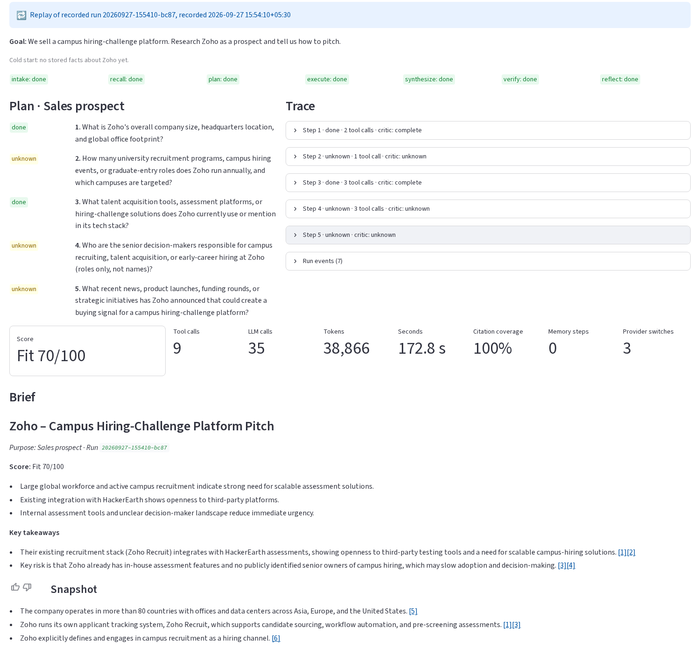
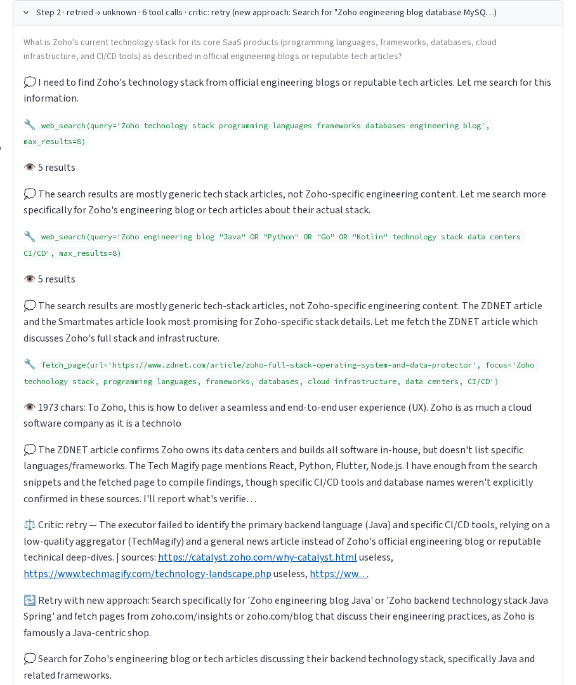
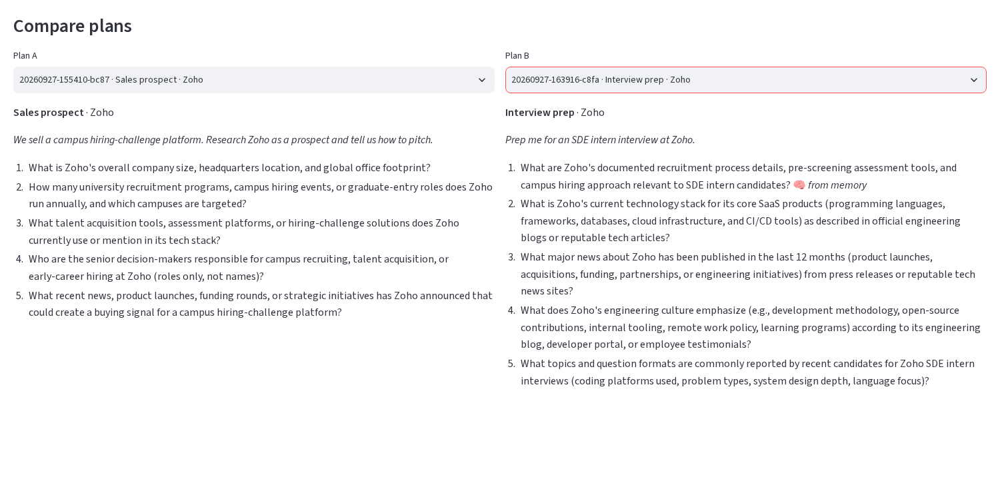

# Scout 🔭
### Research that depends on *why* you are asking

- Same company, different purpose → different facts: a **sales rep**, a **competitor analyst** and an **interview candidate** need different briefs about Zoho
- Most agents run one generic prompt. Scout turns the purpose into a **playbook-guided plan**, cites every claim, checks its own work, and **learns with use**

---

# Architecture

Hand-written state machine (no framework). The orchestrator is a generator of events → CLI, UI and trace all consume the same stream.

**Intake → Recall → Plan → [Execute ⇄ Critique]\* → Synthesize → Verify → Reflect**

| Layer | Choice |
|---|---|
| LLM | OpenAI-compatible wrapper, JSON + Pydantic + 1 repair; **router** across 3 Groq models + Gemini (free tiers) |
| Tools | Tavily → DuckDuckGo search, SSRF-guarded fetch (httpx + trafilatura), `recall_memory` |
| Memory | SQLite: facts, source scores, lessons, feedback, runs |
| UI | Typer + Rich CLI, Streamlit with live runs and **replay** |

---

<!-- _class: tight -->

# Agentic patterns in action

- **Plan-and-Execute**: purpose-shaped plan from playbook + lessons
- **ReAct** per step: think → search / fetch / recall → observe → cited findings
- **Critic routing**: complete · **retry** (new approach) · **follow-up** (replan) · unknown
- **Verifier**: citations must exist; **numbers must appear in a cited snippet**; 1 revision, then Unknowns
- **Reflexion**: lessons written after each run, voted on later

---

<!-- _class: dense -->

# Learns with use: run 2 → run 4

Same question twice ("Prep me for an SDE intern interview at Zoho"):

| | tool calls | LLM calls | tokens | seconds | facts reused |
|---|---|---|---|---|---|
| run 2 | 12 | 31 | 40,040 | 203.7 | 6 |
| run 4 | **8** | **22** | **30,478** | **99.1** | **12** |

- **Same company, new purpose** (run 1 sales → run 2 interview): memory answered Zoho's basics; the plan researched new questions
- **New company, lessons applied** (run 3 Freshworks): 2 lessons written by run 1 shaped the plan
- Fact memory (7 d / 2 d) · source scores `(u+1)/(u+x+2)` · Reflexion lessons

---

# Results and next steps

- **Evals** (13 recorded runs with the verifier): 100% citation coverage; 24 claims flagged, 7 moved to Unknowns instead of published
- **Safety**: untrusted-content wrapping, SSRF guard, roles only (no profiles or contact data), budgets that end in honest partial briefs, traced provider failover
- **Quality**: 258 offline tests; replayable runs; zero-key example replays and Insights

**Next:** scheduled competitor tracking · vector memory · parallel steps · Scout as an MCP server

**Repo:** github.com/UditSinghChauhan/scout-agent (README → quickstart in 5 commands) · MIT
